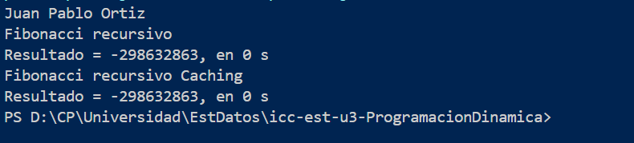
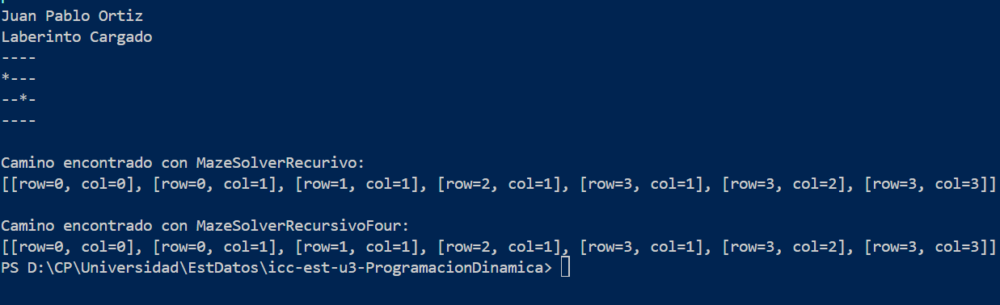

# Programación Dinámica y Laberintos

Este proyecto contiene ejemplos de algoritmos de programación dinámica y resolución de laberintos en Java.

## Estructura de Carpetas

- `src`: Código fuente Java
- `lib`: Dependencias
- `bin`: Archivos compilados

## Ejercicios de Programación Dinámica

Incluye métodos para calcular la serie de Fibonacci de forma recursiva y con optimización por memorización (caching).

- `EjerciciosPD.java`: Métodos `getFibonacci(int n)` y `getFibonacciPD(int n)`

## Resolución de Laberintos

Implementa dos algoritmos para encontrar caminos en un laberinto:

- `MazeSolverRecursive.java`: Búsqueda recursiva simple
- `MazeSolverRecursivoFour.java`: Búsqueda recursiva en cuatro direcciones
- `Maze.java`: Clase para representar y mostrar el laberinto
- `Cell.java`: Representa una celda del laberinto

## Ejecución

El archivo principal es `App.java`. Puedes ejecutar los métodos de Fibonacci y la resolución de laberintos desde aquí.

## Imágenes

